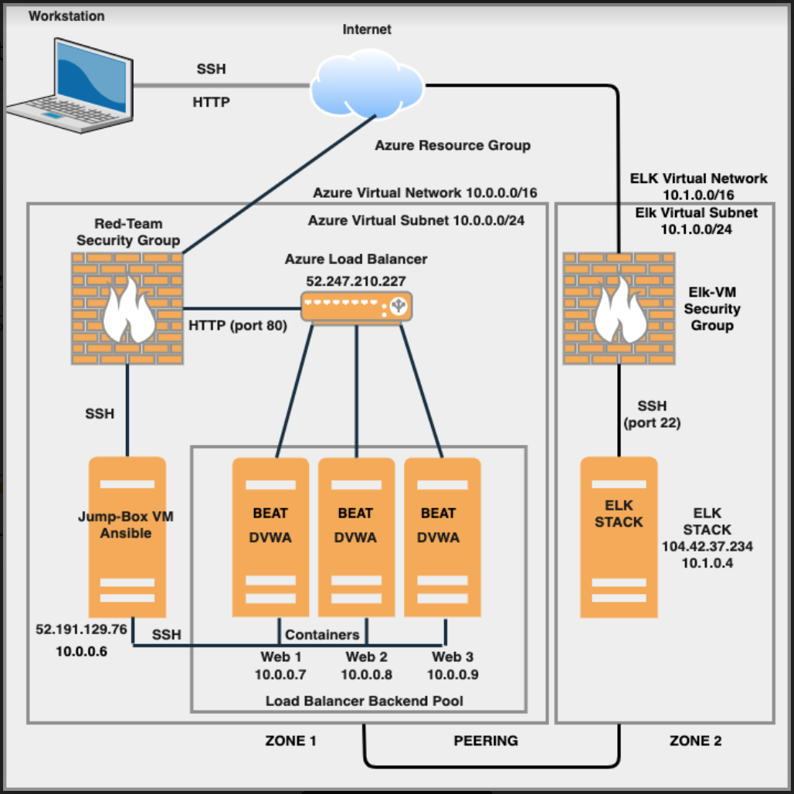

## Automated ELK Stack Deployment

The files in this repository were used to configure the network depicted below.

These files have been tested and used to generate a live ELK deployment on Azure. They can be used to recreate the entire deployment pictured above. Alternatively, select portions of the .yml files may be used to install only certain pieces of it, such as Filebeat.

  - [Filebeat Playbook] (Ansible/Beat-playbooks/filebeat-config.yml)

This document contains the following details:
- Description of the Topologu
- Access Policies
- ELK Configuration
  - Beats in Use
  - Machines Being Monitored
- How to Use the Ansible Build

### Description of the Topology

The main purpose of this network is to expose a load-balanced and monitored instance of DVWA, the D*mn Vulnerable Web Application.

Load balancing ensures that the application will be highly dependable, in addition to restricting access to the network.
- Load balancers help protect against distributed deinial of service (DDoS) attacks. One example of how this can be done is by shifting attack traffic from a corporate server to a public cloud provider. DDoS accounts for a large portion of cybercrime and it can be extremely expensive if a company becomes victim to such an attack. Luckily, the costs associated with temporarily redirecting attack traffic to a cloud provider is far less than traditional hardware defense, such as a permiter firewall. Suplementing a network with a Jump Box can be extremely advantageous. This hidden machine restricts administrative access to the network while reducing operational costs and human error. Vulnerability risks associated with Jump Box's can be mitigated with hardening techniques like reducing subnet size, restricing programs, enabling strong logging, and not allowing outbound access to the rest of the internet from the jump server.  

Integrating an ELK server allows users to easily monitor the vulnerable VMs for changes to the file system and system traffic.
- Filebeat helps generate and organize log files to send to Logstash and Elasticsearch. Specifically, it logs information about the file system, including which files have changed and when.
- Metricbeat is a lightweight shipper that you can install on your servers to periodically collect metrics from the operating system and from services running on the server. Metricbeat takes the metrics and statistics that it collects and ships them to the output that you specify, such as Elasticsearch or Logstash.

The configuration details of each machine may be found below.

| Name                  |        Function        | IP Address | Operating System |
|-----------------------|:----------------------:|:----------:|:----------------:|
| Jump-Box-Provisioner  |         Gateway        |  10.0.0.6  |       Linux      |
| Web-1                 | Docker-DVWA Containers |  10.0.0.7  |       Linux      |
| Web-2                 | Docker-DVWA Containers |  10.0.0.8  |       Linux      |
| Web-3                 | Docker-DVWA Containers |  10.0.0.9  |       Linux      |
| Elk                   |    Configuration VM    |  10.1.0.4  |       Linux      |

### Access Policies

The machines on the internal network are not exposed to the public Internet. 

Only the Jump Box and ELK machines can accept connections from the Internet. Access to these machines are only allowed from the following IP addresses:
- Whitelisted IP's - 73.71.90.40 (Personal Machine)

Machines within the network can only be accessed by accessing the DVWA container on the Jump Box VM.
- The two machines that have access to the ELK VM are my personal IP, 73.71.90.40, and the Jump Box VM (10.0.0.6), through a peering connection.

A summary of the access policies in place can be found in the table below.

| Name                 | Publicly Accessible | Allowed IP Addresses  |
|----------------------|:-------------------:|-----------------------|
| Jump-Box_Provisioner |         YES         | 10.0.0.6, 73.71.90.40 |
| Web-1                |          NO         | 10.0.0.6              |
| Web-2                |          NO         | 10.0.0.6              |
| Web-3                |          NO         | 10.0.0.6              |
| ELK                  |         YES         | 10.0.0.6, 73.71.90.40 |

### Elk Configuration

Ansible was used to automate configuration of the ELK machine. No configuration was performed manually, which is advantageous because...
- _TODO: What is the main advantage of automating configuration with Ansible?_

The playbook implements the following tasks:
- _TODO: In 3-5 bullets, explain the steps of the ELK installation play. E.g., install Docker; download image; etc._
- ...
- ...

The following screenshot displays the result of running `docker ps` after successfully configuring the ELK instance.

### Target Machines & Beats
This ELK server is configured to monitor the following machines:
- _TODO: List the IP addresses of the machines you are monitoring_

We have installed the following Beats on these machines:
- _TODO: Specify which Beats you successfully installed_

These Beats allow us to collect the following information from each machine:
- _TODO: In 1-2 sentences, explain what kind of data each beat collects, and provide 1 example of what you expect to see. E.g., `Winlogbeat` collects Windows logs, which we use to track user logon events, etc._

### Using the Playbook
In order to use the playbook, you will need to have an Ansible control node already configured. Assuming you have such a control node provisioned: 

SSH into the control node and follow the steps below:
- Copy the _____ file to _____.
- Update the _____ file to include...
- Run the playbook, and navigate to ____ to check that the installation worked as expected.

_TODO: Answer the following questions to fill in the blanks:_
- _Which file is the playbook? Where do you copy it?_
- _Which file do you update to make Ansible run the playbook on a specific machine? How do I specify which machine to install the ELK server on versus which to install Filebeat on?_
- _Which URL do you navigate to in order to check that the ELK server is running?

_As a **Bonus**, provide the specific commands the user will need to run to download the playbook, update the files, etc._
