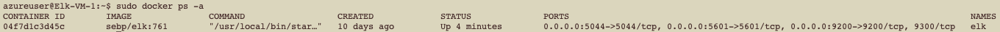
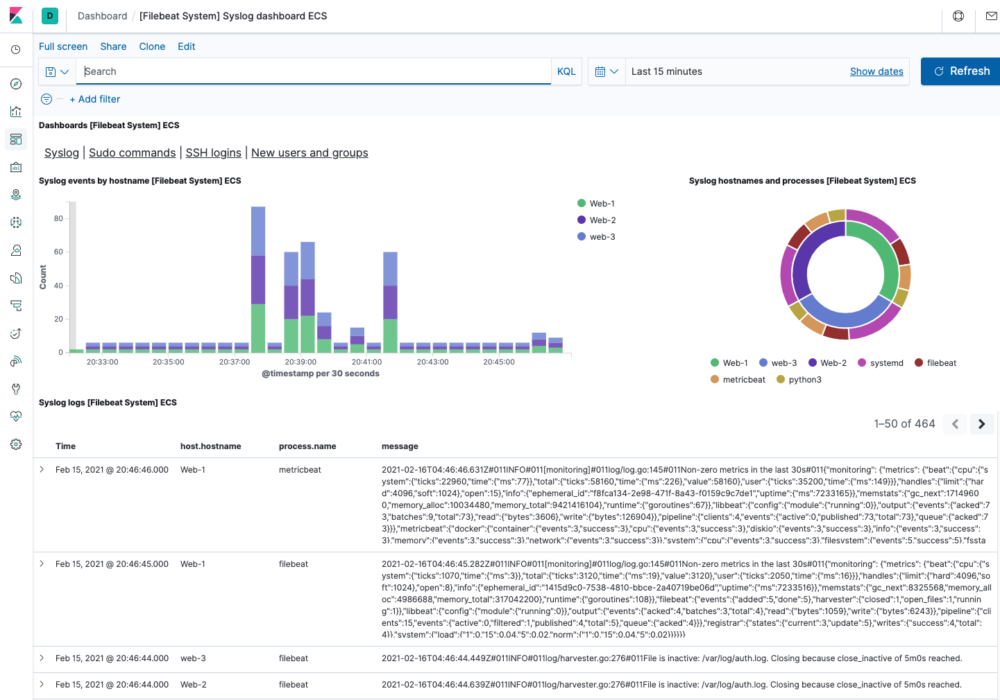
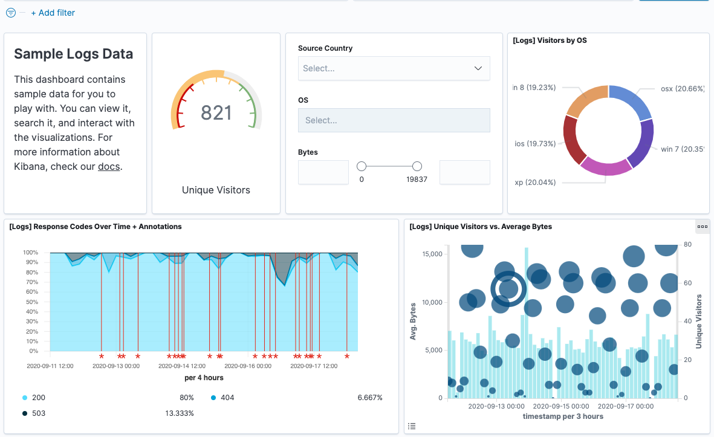
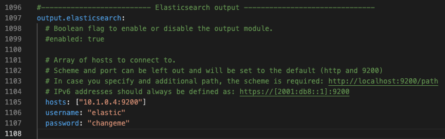
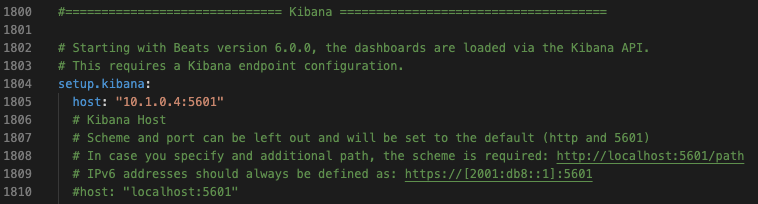

## Automated ELK Stack Deployment

The files in this repository were used to configure the network depicted below.


These files have been tested and used to generate a live ELK deployment on Azure. They can be used to recreate the entire deployment pictured above. Alternatively, select portions of the .yml files may be used to install only certain pieces of it, such as Filebeat.

  - [Filebeat Playbook](Ansible/Beat-playbooks/filebeat-playbook.yml)
This document contains the following details:
- Description of the Topologu
- Access Policies
- ELK Configuration
  - Beats in Use
  - Machines Being Monitored
- How to Use the Ansible Build


### Description of the Topology

The main purpose of this network is to expose a load-balanced and monitored instance of DVWA, the D*mn Vulnerable Web Application.

Load balancing ensures that the application will be highly dependable, in addition to restricting access to the network.
- Load balancers help protect against distributed deinial of service (DDoS) attacks. One example of how this can be done is by shifting attack traffic from a corporate server to a public cloud provider. DDoS accounts for a large portion of cybercrime and it can be extremely expensive if a company becomes victim to such an attack. Luckily, the costs associated with temporarily redirecting attack traffic to a cloud provider is far less than traditional hardware defense, such as a permiter firewall. Suplementing a network with a Jump Box can be extremely advantageous. This hidden machine restricts administrative access to the network while reducing operational costs and human error. Vulnerability risks associated with Jump Box's can be mitigated with hardening techniques like reducing subnet size, restricing programs, enabling strong logging, and not allowing outbound access to the rest of the internet from the jump server.  

Integrating an ELK server allows users to easily monitor the vulnerable VMs for changes to the file system and system traffic.
- Filebeat helps generate and organize log files to send to Logstash and Elasticsearch. Specifically, it logs information about the file system, including which files have changed and when.
- Metricbeat is a lightweight shipper that you can install on your servers to periodically collect metrics from the operating system and from services running on the server. Metricbeat takes the metrics and statistics that it collects and ships them to the output that you specify, such as Elasticsearch or Logstash.

The configuration details of each machine may be found below.

| Name                  |        Function        | IP Address | Operating System |
|-----------------------|:----------------------:|:----------:|:----------------:|
| Jump-Box-Provisioner  |         Gateway        |  10.0.0.6  |       Linux      |
| Web-1                 | Docker-DVWA Containers |  10.0.0.7  |       Linux      |
| Web-2                 | Docker-DVWA Containers |  10.0.0.8  |       Linux      |
| Web-3                 | Docker-DVWA Containers |  10.0.0.9  |       Linux      |
| Elk                   |    Configuration VM    |  10.1.0.4  |       Linux      |

### Access Policies

The machines on the internal network are not exposed to the public Internet. 

Only the Jump Box and ELK machines can accept connections from the Internet. Access to these machines are only allowed from the following IP addresses:
- Whitelisted IP's - 73.71.90.40 (Personal Machine)

Machines within the network can only be accessed by accessing the DVWA container on the Jump Box VM.
- The two machines that have access to the ELK VM are my personal IP, 73.71.90.40, and the Jump Box VM (10.0.0.6), through a peering connection.

A summary of the access policies in place can be found in the table below.

| Name                 | Publicly Accessible | Allowed IP Addresses  |
|----------------------|:-------------------:|-----------------------|
| Jump-Box_Provisioner |         YES         | 10.0.0.6, 73.71.90.40 |
| Web-1                |          NO         | 10.0.0.6              |
| Web-2                |          NO         | 10.0.0.6              |
| Web-3                |          NO         | 10.0.0.6              |
| ELK                  |         YES         | 10.0.0.6, 73.71.90.40 |

### Elk Configuration

Ansible was used to automate configuration of the ELK machine. No configuration was performed manually, which is advantageous because Ansible's agentless architecture allows for flexible integration, and efficient and seamless deployement, while eliminating human error across systems.

The [ELK-Playbook](Ansible/elk_docker.yml) playbook implements the following tasks:
- Install Docker.
- Download cmage.
- Configure container.
- Download and launch a docker elk container.
- Enables service docker on boot.

The following screenshot displays the result of running `docker ps` after successfully configuring the ELK instance.



### Target Machines & Beats
This ELK server is configured to monitor the following machines:

- 10.0.0.7 - Web-1
- 10.0.0.8 - Web-2
- 10.0.0.9 - Web-3

We have installed the following Beats on these machines:

- Filebeat v7.4.0
- Metricbeat v7.4.0

These Beats allow us to collect the following information from each machine:

- Filebeat monitors, collects, and records log files or locations that we specify, and forwards them to either Elasticsearch or Logstach for indexing. Belows image is an example of a Kibana dashboard that is actively collecting Filebeat data.



- Metricbeat is a detailed lightweight shipper that periodically collects metrics from the operating system and from services running on it. Once you deploy Metricbeat and connect it to Elasticsearch, you get system-level CPU usage, memory, file system, disk IO, and network IO statistics, as well as top-like statistics for every process running on your systems.



### Using the Playbook
In order to use the playbook, you will need to have an Ansible control node already configured. Assuming you have such a control node provisioned: 

SSH into the control node and follow the steps below:

- Run the command `sudo docker ps -a` to get the name of the conainter and check the status of said container. 

- Run the command `sudo docker start <container name> && sudo docker attach <container name>` to start and connect to the container.

- Curl the below four commands to copy both Filebeat and Metricbeat configuration and playbook .yml files: 

```bash
curl https://raw.githubusercontent.com/joshdsmith/Elk-Stack/main/Ansible/files/filebeat-config.yml > /etc/ansible/files/filebeat-config.yml
```
```bash
curl https://raw.githubusercontent.com/joshdsmith/Elk-Stack/main/Ansible/Beat-config-files/metricbeat-config.yml > /etc/ansible/files/metricbeat-config.yml
```
```bash
curl https://raw.githubusercontent.com/joshdsmith/Elk-Stack/main/Ansible/Beat-playbooks/filebeat-playbook.yml > /etc/ansible/roles/filebeat-playbook.yml
```
```bash
curl https://raw.githubusercontent.com/joshdsmith/Elk-Stack/main/Ansible/Beat-playbooks/metricbeat-playbook.yml > /etc/ansible/roles/metricbeat-playbook.yml
```
- Update the filebeat-config.yml file to include your ELK servers private IP address in line 1106 and 1806.

- Update the metricbeat-config.yml file to include your ELK servers private IP address in line 62 and 95.

- Run the playbooks using the command `ansible-playbook /etc/ansible/roles/filebeat-playbook.yml && ansible-playbook /etc/ansible/roles/metricbeat-playbook.yml`. Then navigate to kibana at [ELK public IP]:5601/app/kibana to check that the installation worked as expected.
